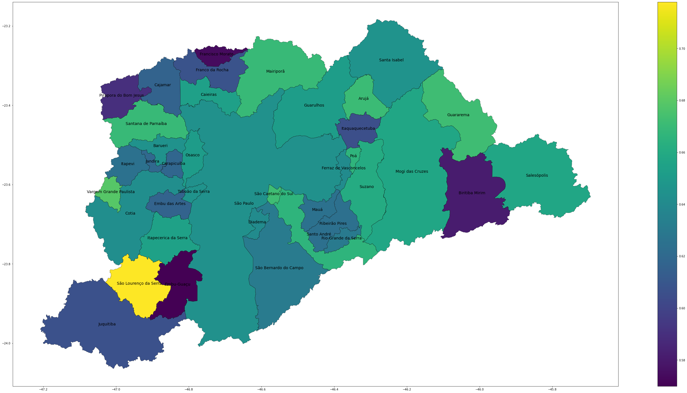
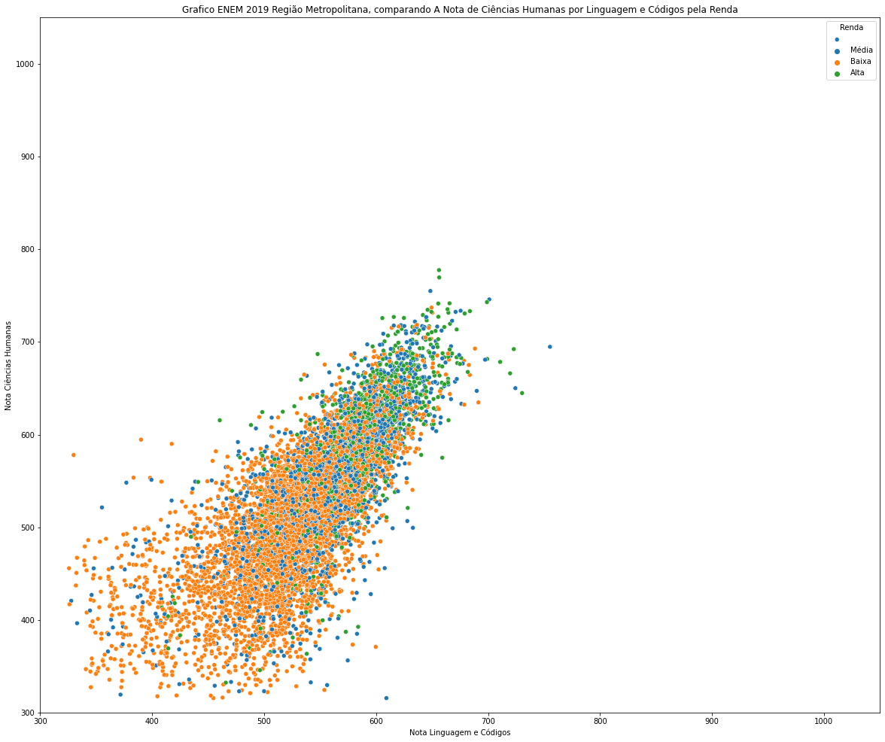

# Imersão Dados Alura 2 Semestre 2020

## Descrição Evento

Vamos explorar base de dados do sistema educacional, criar um modelo de Machine Learning utilizando o Python e as principais bibliotecas na área de Data Science.

## Tecnologias Utilizadas

* Python
* Google Colab (Jupyter Notebook)
* Pandas / GeoPandas
* Machine Learning

## Posts Linkedin

* [Aula 01/02](https://www.linkedin.com/posts/lucasnunesdeassis_imersaetodados-activity-6725088210076151808-yOq2)
* [Aula 03](https://www.linkedin.com/posts/lucasnunesdeassis_imersaetodados-activity-6725420166945099776-rcmV)
* [Aula 04](https://www.linkedin.com/posts/lucasnunesdeassis_imersaetodados-activity-6725815674184241152-_ALh)
* [Projeto Final](https://www.linkedin.com/posts/lucasnunesdeassis_imersaetodados-activity-6726319623618269184-OadJ)

## Screenshots

